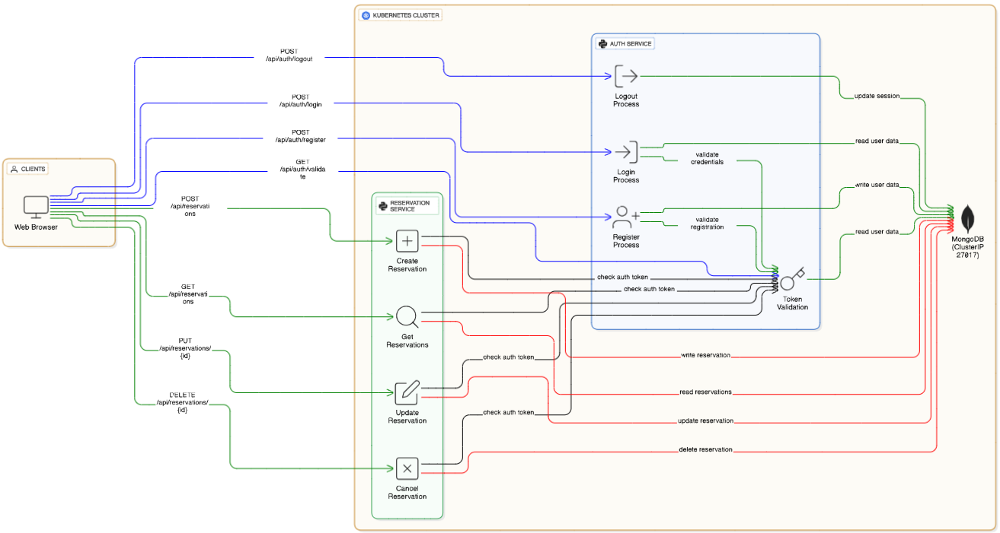

# ReserveIt: A Microservice-Based Reservation System

  

A simple, scalable, and containerized resource reservation application built with a microservice architecture. This project is designed to be deployed on Kubernetes and demonstrates key cloud-native principles.

***

## 🏛️ System Architecture

The application is composed of two primary microservices, a database, and a client, all orchestrated by Kubernetes. The **Auth Service** acts as a public-facing API Gateway, while the **Reservation Service** handles the core business logic internally.

!(https://raw.githubusercontent.com/nsnkk2003/reserveit/main/architectural_diagram.png)


***

## ✨ Features

- **User Authentication**: Secure user registration and login.
- **Resource Browsing**: View a list of available resources (e.g., meeting rooms, tables).
- **Slot Booking**: Check availability and book time slots for a specific date.
- **Booking Management**: View and cancel your personal reservations.
- **Scalable by Design**: Independently scalable microservices.
- **Persistent Storage**: Ensures user and booking data survives pod restarts.

***

## 💻 Tech Stack

The project is built with a modern, container-native stack:

- **Backend**: Python, Flask
- **Database**: MongoDB
- **Containerization**: Docker
- **Orchestration**: Kubernetes

***

## 🚀 Getting Started

Follow these instructions to get the project deployed and running on a Kubernetes cluster.

### Prerequisites

- A running Kubernetes cluster (e.g., [Minikube](https://minikube.sigs.k8s.io/docs/start/), Docker Desktop).
- `kubectl` command-line tool configured to connect to your cluster.
- Docker Hub account to host your container images.

### Deployment Steps

1.  **Clone the Repository**
    ```bash
    git clone [https://github.com/nsnkk2003/reserveit.git](https://github.com/nsnkk2003/reserveit.git)
    cd reserveit
    ```

2.  **Build and Push Docker Images**
    You must build the images for both the `auth` and `reservation` services and push them to your Docker Hub repository. Make sure the image names in `deployment.yaml` match your Docker Hub paths (`nsnkk2003/auth-service:latest` and `nsnkk2003/reservation-service:latest`).

3.  **Deploy to Kubernetes**
    Apply the Kubernetes manifest file to create all the necessary deployments, services, and the persistent volume claim.
    ```bash
    kubectl apply -f deployment.yaml
    ```

4.  **Check the Deployment Status**
    Wait for all pods to be in the `Running` state.
    ```bash
    kubectl get pods
    ```
    You should see pods for `auth-deployment`, `reservation-deployment`, and `mongo-deployment`.

5.  **Access the Application**
    The `auth-service` is exposed via a `NodePort`. Use this command to find the URL and open it in your browser (works best with Minikube).
    ```bash
    minikube service auth-service
    ```
    For other clusters, find the `NodePort` by running `kubectl get service auth-service` and access the application at `http://<node-ip>:<node-port>`.

***

## 🔌 Endpoints

The application exposes the following REST API endpoints through the `auth-service` gateway:

| Method | Endpoint                    | Description                           |
| :----- | :-------------------------- | :------------------------------------ |
| `POST` | `/api/auth/register`        | Register a new user.                  |
| `POST` | `/api/auth/login`           | Log in an existing user.              |
| `GET`  | `/api/resources`            | Get a list of all available resources.|
| `GET`  | `/api/slots/<res_id>/<date>`| Get available slots for a resource.   |
| `POST` | `/api/book`                 | Book a new reservation.               |
| `GET`  | `/api/bookings/<user_id>`   | Get all bookings for a user.          |
| `POST` | `/api/cancel/<booking_id>`  | Cancel an existing booking.           |

***


